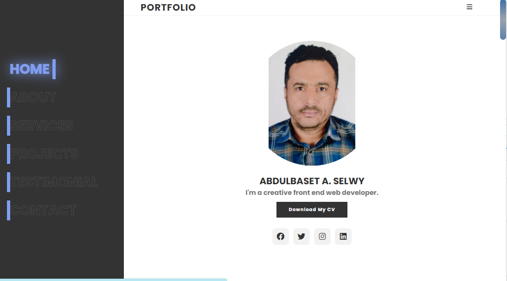
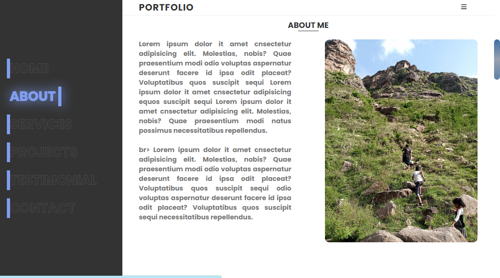
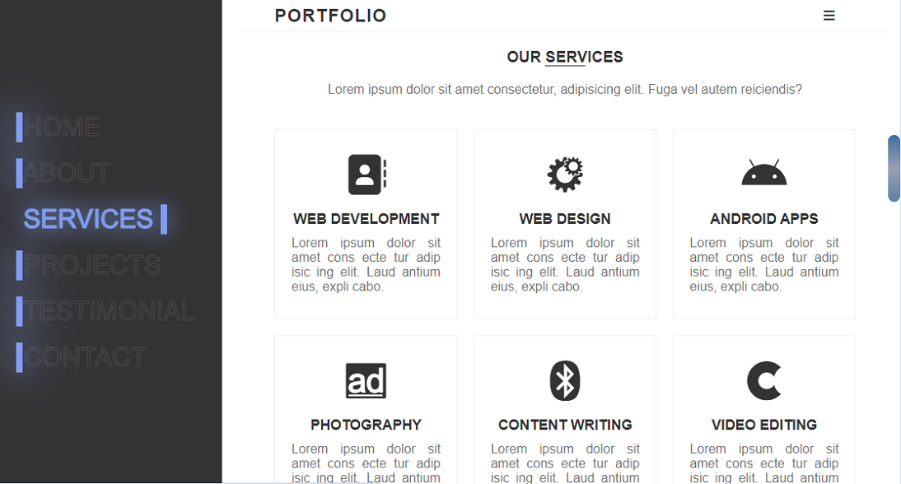
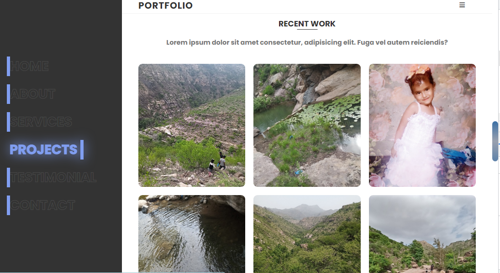
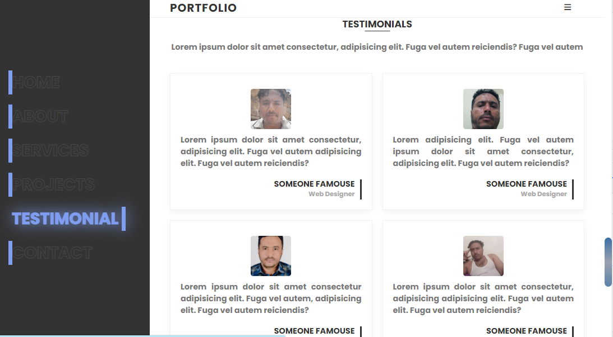
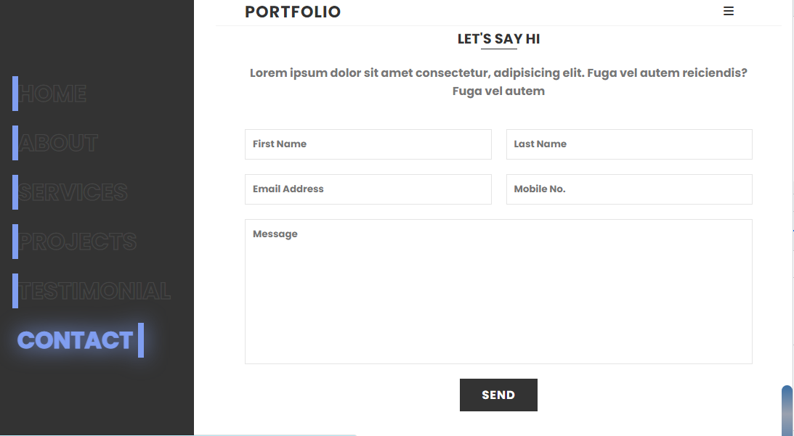
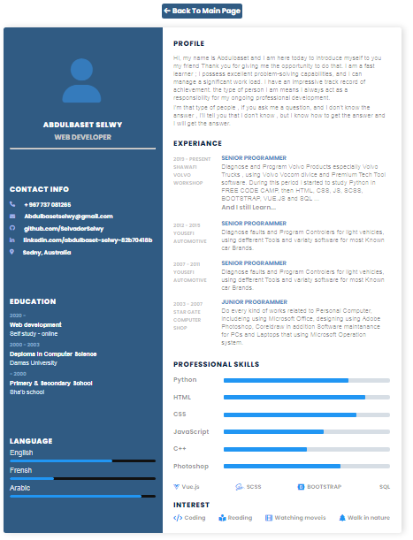

#Portfolio Website

A Responsive Portfolio website coding by HTML, CSS and JS.

        

            
        

        

            
        

        

            
        

        

            
        

        

            
        

        

            
        

        

            
        

    

# Portfolio-Website
This is a portfolio website design build by HTML , CSS and JS.
In fact I build it upon a tutorial for somebody, I am not sure who was , may be he is ONLINE TUTORIAl , or another indian front end developer. 
what ever , Thank you for him , he helped me develope my skills .
